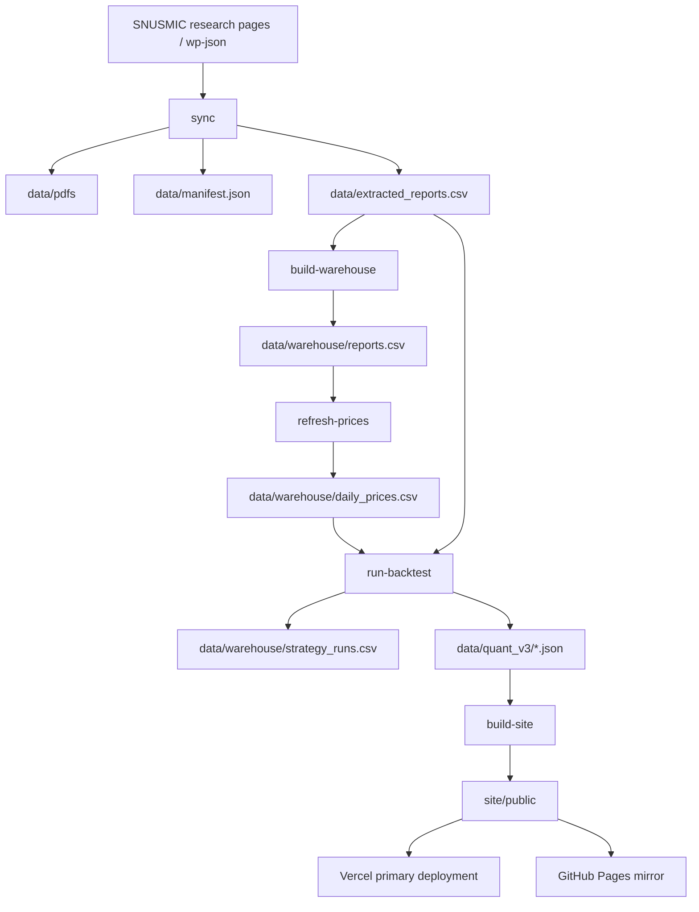
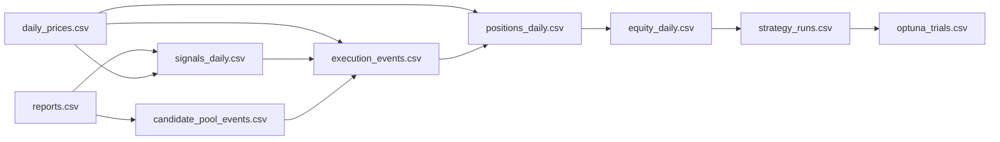
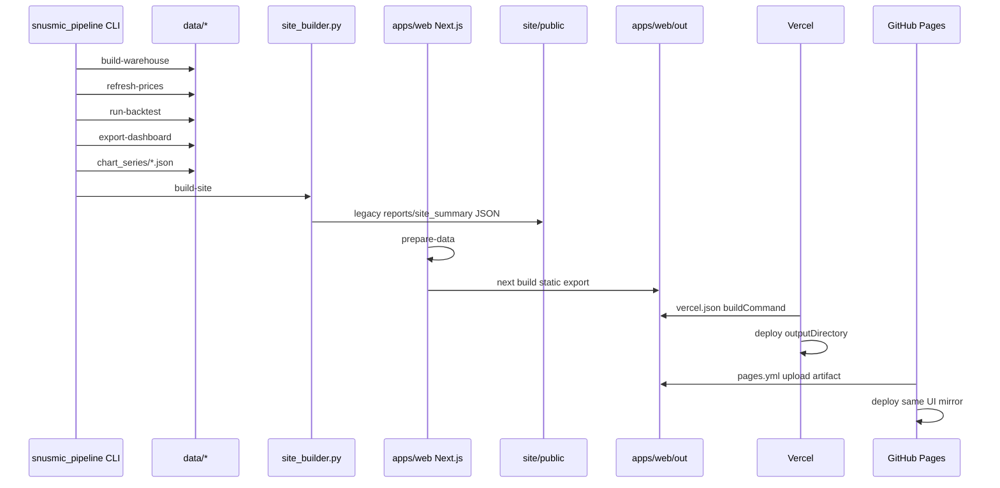

# SNUSMIC Quant Platform

SNUSMIC 리서치 PDF를 장기 보관하고, 목표가/티커/메타데이터를 추출하고, 가격 데이터를 붙여서 candidate pool 기반의 walk-forward 백테스트와 Quant Terminal 대시보드까지 만드는 저장소입니다.

주요 링크:

- GitHub repo: <https://github.com/ChoiInYeol/snusmic-quant-terminal>
- Vercel primary: <https://snusmic-quant-terminal.vercel.app>
- GitHub Pages mirror: <https://choiinyeol.github.io/snusmic-quant-terminal/>

이 문서는 “로컬에서 맛보기로 돌리는 방법”이 아니라, 이 저장소를 **서버로 옮겨 실제로 archive를 키우고 백테스트를 돌릴 사람**을 위한 운영 문서입니다. 데이터 구조, 실행 순서, 자동화, 주의점까지 한 번에 담았습니다.

## 1. 현재 상태 요약

현재 저장소 기준 아카이브 상태:

- SNUSMIC archive coverage: `page 1-18`
- 저장된 PDF 수: `216`
- `data/manifest.json` 행 수: `216`
- `data/extracted_reports.csv` 행 수: `216`
- 가장 오래된 리포트 날짜: `2020-10-31`
- 가장 최신 리포트 날짜: `2026-04-16`

중요:

- 현재 archive는 2020년에 진입했지만, **2020년 전체를 다 커버한 상태는 아닙니다**.
- 추가 archive 확장은 `page 19`부터 이어서 진행하면 됩니다.
- 최근에는 archive만 확장했고, 새로 추가된 리포트 전체에 대해 가격/백테스트를 항상 즉시 재계산한 것은 아닐 수 있으므로, 서버에서 한 번 정식 재생성을 권장합니다.

## 2. 이 저장소가 하는 일

이 저장소의 역할은 크게 다섯 가지입니다.

1. SNUSMIC 리서치 목록 수집
2. PDF 다운로드 및 파일명 정규화
3. PDF 텍스트/목표가/티커 추출
4. 가격 데이터 정규화와 백테스트
5. Vercel 대시보드 배포와 GitHub Pages 미러

즉, “리포트 아카이브”, “정형 데이터 파이프라인”, “퀀트 백테스터”, “배포 가능한 리서치 터미널”이 한 저장소 안에 같이 있습니다.

## 3. 전체 파이프라인



## 4. 핵심 개념

### 4.1 Candidate Pool

투자 후보군입니다. 리포트가 발간되면 다음 거래일부터 candidate pool에 편입됩니다.

### 4.2 Execution Pool

실제로 전략이 보유하는 종목 집합입니다. MTT, target upside, stop-loss, rebalancing 조건을 통과한 종목만 들어갑니다.

### 4.3 Archive

원문 PDF와 그에 대응하는 메타데이터입니다. `manifest.json`, `extracted_reports.csv`, `data/pdfs/`가 archive의 핵심입니다.

### 4.4 Warehouse

백테스트와 대시보드의 SSOT 역할을 하는 정규화 CSV 레이어입니다. DuckDB는 이 CSV를 읽어 로컬 쿼리/검증 용도로만 씁니다.

### 4.5 Dashboard Artifacts

Vercel 앱, GitHub Pages 미러, 선택적 Quarto 문서가 읽는 JSON 산출물입니다. `data/quant_v3/` 아래에 생깁니다.

## 5. 디렉터리 구조

```text
src/snusmic_pipeline/
  fetch_index.py
  download_pdfs.py
  extract_pdf.py
  markdown_export.py
  cli.py
  backtest/
    engine.py
    warehouse.py
    signals.py
    optimizers.py
    schemas.py

data/
  pdfs/
  manifest.json
  extracted_reports.csv
  markdown/
  price_metrics.json
  portfolio_backtests.json
  warehouse/
  quant_v3/

site/
  public/
  quarto/

.github/workflows/
  sync.yml
  price-refresh.yml
```

## 6. 서버에 옮길 때의 권장 환경

권장 서버 성격:

- 로컬 맥북 Air 대신, CPU/메모리가 더 넉넉한 Linux 서버
- 백그라운드로 긴 yfinance 수집과 Optuna 실험을 돌릴 수 있는 환경
- Optuna/가격 갱신까지 같이 돌릴 예정이면 시스템 패키지/네트워크/브라우저 캐시 이슈를 감당할 수 있는 환경

권장 사양:

- CPU: 8코어 이상 권장
- RAM: 16GB 이상 권장
- 디스크: 최소 수 GB, 여유 있게 20GB 이상 권장
- Python: `3.12`
- Java: OpenDataLoader hybrid OCR을 쓸 경우 `21` 또는 최소 `11+`

## 7. 필수 도구

서버에서 필요한 도구:

- `git`
- `python3.12`
- `uv`
- `quarto` CLI
- 선택: `java`

확인 예시:

```bash
python3 --version
uv --version
quarto --version
java -version
git --version
```

## 8. 서버 초기 설치

처음 서버에서 시작할 때:

```bash
git clone https://github.com/ChoiInYeol/snusmic-quant-terminal.git
cd snusmic-quant-terminal

uv sync --group dev
```

OCR fallback이나 hybrid OCR까지 쓸 계획이면:

```bash
uv sync --group dev --extra ocr
```

Quarto 문서 사이트를 별도로 렌더하고 싶다면 서버에 Quarto CLI를 설치합니다. 다만 현재 기본 배포 경로는 `vercel.json`이 지정한 `site/public`입니다.

## 9. 추천 서버 부팅 순서

서버에서는 보통 아래 순서가 가장 안전합니다.

```bash
uv sync --group dev --extra ocr
uv run python -m snusmic_pipeline build-warehouse
uv run python -m snusmic_pipeline refresh-prices
uv run python -m snusmic_pipeline run-backtest
uv run python -m snusmic_pipeline optimize-strategies --trials 100
uv run python -m snusmic_pipeline export-dashboard
uv run python -m snusmic_pipeline build-site
```

이 순서를 기준선으로 생각하면 됩니다.

## 10. CLI 명령 개요

주요 명령:

```bash
uv run python -m snusmic_pipeline sync
uv run python -m snusmic_pipeline build-warehouse
uv run python -m snusmic_pipeline refresh-prices
uv run python -m snusmic_pipeline run-backtest
uv run python -m snusmic_pipeline optimize-strategies
uv run python -m snusmic_pipeline export-dashboard
uv run python -m snusmic_pipeline build-site
uv run python -m snusmic_pipeline refresh-market
uv run python -m snusmic_pipeline export-markdown
```

역할:

- `sync`: SNUSMIC에서 PDF/CSV/archive를 가져옴
- `build-warehouse`: archive를 정규화 CSV로 변환
- `refresh-prices`: yfinance OHLCV 수집
- `run-backtest`: 기본 전략 백테스트
- `optimize-strategies`: Optuna 실험
- `export-dashboard`: 대시보드용 JSON 생성
- `build-site`: Vercel과 GitHub Pages가 그대로 배포할 `site/public` 산출물 생성
- `refresh-market`: 구 price metric / cohort artifact 갱신
- `export-markdown`: PDF별 markdown 원문 생성

## 11. Archive 확장 방법

### 11.1 새 페이지 범위를 한 번에 받을 때

예를 들어 page 19-25를 서버에서 바로 받을 때:

```bash
uv run python -m snusmic_pipeline sync \
  --pages 19-25 \
  --no-market-data
```

이렇게 하면:

- `data/pdfs/`
- `data/manifest.json`
- `data/extracted_reports.csv`

가 갱신됩니다.

### 11.2 Archive만 늘리고 분석은 나중에 할 때

대용량 archive 확장 중에는 가격/백테스트까지 같이 돌리면 너무 무거우므로, 먼저 archive만 끝내고 나중에 아래 순서로 분석을 따로 돌리는 게 좋습니다.

```bash
uv run python -m snusmic_pipeline build-warehouse
uv run python -m snusmic_pipeline refresh-prices
uv run python -m snusmic_pipeline run-backtest
uv run python -m snusmic_pipeline export-dashboard
```

## 12. PDF 추출 전략

기본 추출 순서:

1. `pypdf`
2. OpenDataLoader fallback
3. 필요 시 hybrid OCR

기본적으로는 `pypdf`가 가장 가볍고 빠릅니다. 스캔 PDF 비중이 커질 때만 OCR을 강하게 쓰는 편이 낫습니다.

Hybrid OCR 예시:

```bash
uv run opendataloader-pdf-hybrid --port 5002 --force-ocr --ocr-lang "ko,en"
uv run python -m snusmic_pipeline sync --pages 19-25 --opendataloader-hybrid docling-fast
```

## 13. Warehouse 설계

`data/warehouse/`는 SSOT입니다.

핵심 테이블:

- `reports.csv`
- `daily_prices.csv`
- `signals_daily.csv`
- `candidate_pool_events.csv`
- `execution_events.csv`
- `positions_daily.csv`
- `equity_daily.csv`
- `strategy_runs.csv`
- `optuna_trials.csv`

DuckDB는 이 CSV에서 다시 생성됩니다. 즉:

- **CSV가 진짜 원본**
- DuckDB는 로컬 분석용 파생물

## 14. Warehouse 테이블 관계



## 15. 백테스트 엔진 요약

백테스트는 cohort 방식이 아니라 event-driven walk-forward 방식입니다.

핵심 특징:

- 미래 참조 없음
- 리포트 발간 후 candidate pool 누적
- 조건 통과 종목만 execution pool 편입
- 산술 일수익률 기반 누적
- realized return과 live return 분리

## 16. 기본 전략

기본 대시보드는 **24M lookback 대표 전략 7개**만 계산합니다.

- `MTT / 1N / 24M`
- `MTT / Sharpe / 24M`
- `MTT / Sortino / 24M`
- `MTT+목표 / CVaR / 24M`
- `Target only / Calmar / 24M`
- `MTT / Max return / 24M`
- `MTT / Min var / 24M`

이건 로컬/가벼운 서버용 기본 세트입니다.

## 17. Optuna 실험

Optuna는 더 넓은 파라미터 공간을 탐색합니다.

현재 탐색 대상:

- weighting: `1/N`, `max_return`, `min_var`, `sharpe`, `sortino`, `cvar`, `calmar`
- entry rule: `mtt`, `target_only`, `mtt_target`
- MTT slope months
- pool months
- target hit multiplier
- stop loss
- reward:risk
- rebalance
- lookback: `3M / 6M / 12M / 24M`
- min target upside

예시:

```bash
uv run python -m snusmic_pipeline optimize-strategies --trials 300
```

서버에서는 이 부분이 제일 오래 걸릴 수 있습니다.

## 18. Lookback 윈도우 해석

현재 코드상 lookback label은 다음과 같습니다.

| Label | Trading days | 의미 |
|---|---:|---|
| `3M` | 63 | 최근 추세 반응이 빠름 |
| `6M` | 126 | 중기 추세 |
| `12M` | 252 | 1년 기준 |
| `24M` | 504 | 2년 기준 |

기본 대시보드는 24M만 계산하고, 전체 비교는 Optuna에서 합니다.

## 19. 현재 대시보드가 중점적으로 보여주는 것

최근 UX는 “현재 무엇을 얼마나 왜 들고 있는지”를 먼저 보도록 바뀌었습니다.

특히 `portfolio.html` / `pools.html`에서 중요하게 보는 것은:

- 현재 비중 100% stacked bar
- 현재 보유 종목 표
- 진입 후 수익률
- 전략 기여도
- 최근 매수/매도 최신순
- 누적 자산과 최대낙폭 분리

즉, 과거 풀원장 덤프보다 현재 포지션을 우선합니다.

## 20. 대시보드 렌더 흐름



Vercel은 `vercel.json`을 기준으로 Next.js 정적 산출물인 `apps/web/out`을 빌드합니다.

```json
{
  "$schema": "https://openapi.vercel.sh/vercel.json",
  "framework": null,
  "installCommand": "cd apps/web && npm ci",
  "buildCommand": "PYTHONPATH=src python -c 'from pathlib import Path; from snusmic_pipeline.site_builder import build_site; build_site(Path(\"data\"), Path(\"site/public\"))' && npm --prefix apps/web run prepare-data && npm --prefix apps/web run build",
  "outputDirectory": "apps/web/out"
}
```

이 빌드 경로는 Vercel에서 무거운 Python 계산을 다시 돌리지 않습니다. 이미 커밋된 `data/` 산출물을 Next.js `public/data`로 복사한 뒤, TradingView Lightweight Charts 기반 정적 Quant Terminal을 생성합니다.

GitHub Pages도 같은 UI를 적용합니다. `.github/workflows/pages.yml`은 `GITHUB_PAGES=true`와 `NEXT_PUBLIC_BASE_PATH=/snusmic-quant-terminal`로 Next.js static export를 만든 뒤 `apps/web/out`을 Pages artifact로 올립니다. FastAPI/SSR/API routes 없이 정적 JSON만 읽기 때문에 Vercel primary와 Pages mirror가 같은 화면을 공유할 수 있습니다.

## 21. GitHub, Vercel, Pages의 역할

워크플로는 세 개입니다.

### 21.1 `sync.yml`

- push
- manual dispatch
- daily scheduled check

역할:

- page 1 신규 리포트 감지
- 필요할 때만 heavy sync 실행
- archive/warehouse/backtest 산출물 갱신
- Vercel 배포 artifact smoke build

### 21.2 `price-refresh.yml`

- scheduled market refresh
- manual dispatch

역할:

- market data refresh
- warehouse/backtest/dashboard 재생성
- Vercel 배포 artifact smoke build

### 21.3 `pages.yml`

- push
- manual dispatch

역할:

- `site/public`의 legacy data shell 재생성
- Next.js static export 생성
- GitHub Pages artifact 업로드
- Vercel과 동일한 Quant Terminal UI를 Pages mirror로 배포

`sync.yml`과 `price-refresh.yml`은 같은 브랜치에 generated data artifact를 커밋하므로, 현재는 같은 concurrency group으로 serialize됩니다. `pages.yml`은 계산을 다시 하지 않고 committed data를 읽어서 화면만 배포합니다.

운영 모델은 단순합니다.

- **GitHub**: 원본 PDF, CSV/JSON 산출물, Actions 기반 데이터 갱신, 코드 리뷰의 SSOT
- **Vercel**: `apps/web/out`을 빠르게 빌드하고 사용자-facing Next.js Quant UI를 배포
- **GitHub Pages**: 같은 Next.js static export를 배포하는 정적 mirror. Vercel 장애, 도메인 변경, 외부 공유용 백업 경로로 사용
- **Quarto**: 연구 문서/방법론 페이지를 별도로 정리하고 싶을 때 쓸 수 있는 보조 경로

Vercel 프로젝트를 GitHub 저장소에 연결하면 Actions가 data artifact를 커밋한 뒤 push 이벤트로 Vercel 배포가 이어집니다. Pages는 repository Settings > Pages에서 Source를 `GitHub Actions`로 두면 `pages.yml`이 같은 UI를 배포합니다. 수동 검증이나 즉시 배포가 필요할 때는 Vercel CLI 또는 Codex Vercel connector로 현재 커밋을 배포하면 됩니다.

## 22. 서버에서 권장하는 실제 운영 루틴

### 22.1 Archive만 늘릴 때

```bash
uv run python -m snusmic_pipeline sync \
  --pages 19-25 \
  --no-market-data
```

### 22.2 Archive 확장 후 정식 재생성

```bash
uv run python -m snusmic_pipeline build-warehouse
uv run python -m snusmic_pipeline refresh-prices
uv run python -m snusmic_pipeline run-backtest
uv run python -m snusmic_pipeline optimize-strategies --trials 100
uv run python -m snusmic_pipeline export-dashboard
uv run python -m snusmic_pipeline build-site
```

### 22.3 아주 긴 실험을 돌릴 때

가능하면 `tmux`, `screen`, 혹은 systemd/cron 기반의 별도 서버 세션에서 돌리는 걸 권장합니다.

## 23. 서버 이전 시 체크리스트

- 저장소 clone 완료
- `uv sync --group dev` 완료
- Vercel 배포 연결 또는 수동 배포 권한 확인
- GitHub Pages mirror를 쓸 경우 Pages source가 `GitHub Actions`인지 확인
- 선택: Quarto 문서 사이트를 별도 렌더할 경우 Quarto 설치 완료
- Java 필요 여부 확인
- `data/pdfs/` 용량 확인
- `data/warehouse/`와 `data/quant_v3/` 생성 확인
- yfinance outbound 네트워크 확인
- Git push 권한 확인

## 24. 외부 출력은 Vercel 중심, Pages는 미러

현재 운영 출력은 Vercel이 배포하는 `apps/web/out` Next.js 정적 대시보드입니다. GitHub Pages는 같은 Next.js static export를 올리는 mirror입니다.

정형 데이터는 `data/warehouse/`와 `data/quant_v3/`에 남기고, 공유용 화면은 `apps/web`이 `public/data`로 복사해서 렌더합니다. 서버에서는 계산을 끝낸 뒤 `uv run python -m snusmic_pipeline export-dashboard`, `uv run python -m snusmic_pipeline build-site`, `npm --prefix apps/web run prepare-data`, `npm --prefix apps/web run build` 순서로 Vercel과 GitHub Pages가 같은 산출물을 재현할 수 있습니다.

Quant Terminal UI의 우선순위:

1. 현재 선택 전략의 보유 종목, 비중, 수익률
2. 최근 매수/매도와 편출 사유
3. Lightweight Charts 기반 종목 OHLCV, 이동평균선, 목표가, 매매 marker
4. 누적 자산과 최대낙폭
5. 리포트별 가격 기회

## 25. 파일이 큰 이유

이 저장소는 코드 저장소이면서 동시에 리포트 archive 역할도 합니다.

용량이 커지는 주범:

- `data/pdfs/`
- `data/manifest.json`
- `data/extracted_reports.csv`
- `data/warehouse/daily_prices.csv`

반대로 커밋하지 않는 것:

- DuckDB WAL
- Quarto `_site`
- Quarto copied data cache
- Vercel / Pages build output인 `site/public/`
- 각종 local cache

## 26. 자주 쓰는 명령 모음

### 데이터 상태 확인

```bash
python3 - <<'PY'
import json, csv
from pathlib import Path
manifest=json.load(open('data/manifest.json', encoding='utf-8'))
with open('data/extracted_reports.csv', encoding='utf-8', newline='') as f:
    rows=list(csv.DictReader(f))
print('manifest', len(manifest))
print('csv', len(rows))
print('pdfs', len(list(Path('data/pdfs').glob('*.pdf'))))
print('oldest', min(r['게시일'][:10] for r in rows if r.get('게시일')))
print('newest', max(r['게시일'][:10] for r in rows if r.get('게시일')))
PY
```

### 전략 산출물 확인

```bash
python3 - <<'PY'
import json
runs=json.load(open('data/quant_v3/strategy_runs.json', encoding='utf-8'))
best=max(runs, key=lambda r: r['total_return'])
print(best['strategy_name'], best['total_return'], best['max_drawdown'])
PY
```

### Optuna lookback 확인

```bash
python3 - <<'PY'
import json
trials=json.load(open('data/quant_v3/optuna_trials.json', encoding='utf-8'))
print(sorted(set(t['lookback_days'] for t in trials)))
PY
```

## 27. 장애 대응 / 트러블슈팅

### 27.1 SNUSMIC가 열리지 않을 때

- `http://snusmic.com/research/` 직접 확인
- `http://snusmic.com/wp-json/wp/v2/posts` 확인
- 사이트 트래픽 제한인지 확인
- archive만 확장하려면 page 범위를 작게 쪼개서 시도

### 27.2 Quarto render가 가끔 `unable to open database file`

선택적 Quarto 문서 사이트를 렌더할 때만 해당합니다. 로컬 Quarto/Deno 캐시 잠금 이슈처럼 보일 때가 있으며, 같은 명령 재시도로 풀리는 경우가 있습니다.

### 27.3 GitHub Actions bot push가 `fetch first`로 실패

이미 workflow concurrency를 넣어 두었습니다. 그래도 race가 나면, 동시에 같은 브랜치에 수동 push가 있었는지 먼저 확인합니다.

### 27.4 현재가가 비어 보일 때

시장마다 거래일이 달라서 발생할 수 있습니다. 현재 코드는 각 종목의 마지막 유효 가격으로 보정합니다. 브라우저에서 stale JSON이 보이면 hard refresh가 아니라 새 배포를 기다리거나 cache-busting이 반영된 최신 JS를 확인하세요.

### 27.5 맥북 Air에서 너무 무거울 때

- 기본 run-backtest만 사용
- Optuna는 서버로 이동
- archive 확장 시 `--no-market-data`
- OCR는 정말 필요할 때만

## 28. 서버 운영 권장 원칙

- archive 확장과 analytics 재생성은 분리
- 기본 대시보드는 가볍게, 실험은 무겁게
- generated artifact는 순서대로 만들고 검증 후 커밋
- Vercel과 Pages는 결과 공유용, 서버는 계산용으로 역할 분리
- 큰 archive 경계가 정해진 뒤 price/backtest를 재생성

## 29. 다음에 할 일

현재 기준 자연스러운 다음 단계:

1. `page 19+`로 내려가서 2020년 초반까지 archive 확장
2. 서버에서 full `refresh-prices` + `run-backtest`
3. Optuna trial 수 확대
4. archive 전체에 대해 markdown 재생성
5. Quant Terminal UI에서 전략별 현재 포지션과 매매 사유 추가 정제

## 30. 한 줄 운영 요약

서버에서는:

1. archive를 먼저 넓히고
2. warehouse를 만들고
3. price/backtest를 돌리고
4. dashboard JSON을 뽑고
5. `build-site`로 정적 artifact를 만들고 Vercel 또는 GitHub Pages에 배포하면 됩니다.
